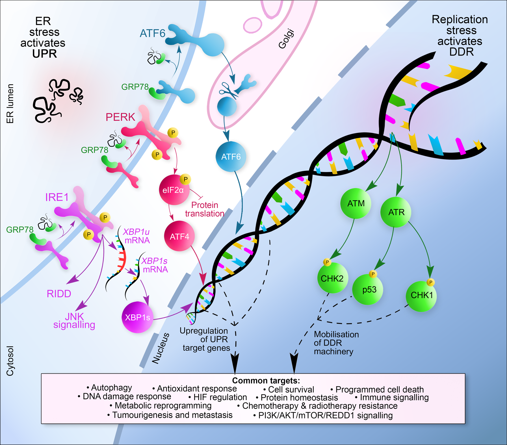

Authors: Hannah Bolland, Tiffany Ma, Syafiq Ramlee, Kristijan Ramadan, & Ester Hammond.

💡 Lay summary
------
- Low oxygen levels (hypoxia) in tumours make cancer cells harder to treat with radiation (radiotherapy). 

- Cells respond to hypoxia by activating two protective systems: one fixes damaged DNA (the 'DDR' pathway), and the other helps manage the accumulation of unfolded proteins (the 'UPR' pathway). 

- In this paper, we reviewed studies exploring how the DDR and UPR might work together under hypoxia, and found potential molecular targets that could help improve how well radiotherapy works.

⚙️ The UPR and DDR pathways
------

📝 Abstract
------
Hypoxia is a feature of most solid tumours and predicts for poor prognosis. In radiobiological hypoxia (<0.1% O2) cells become up to three times more resistant to radiation. The biological response to radiobiological hypoxia is one of few physiologically relevant stresses that activates both the unfolded protein and DNA damage responses (UPR and DDR). Links between these pathways have been identified in studies carried out in normoxia. Based in part on these previous studies and recent work from our laboratory, we hypothesised that the biological response to hypoxia likely includes overlap between the DDR and UPR. While inhibition of the DDR is a recognised strategy for improving radiation response, the possibility of achieving this through targeting the UPR has not been realised. We carried out a systematic review to identify links between the DDR and UPR, in human cell lines exposed to <2% O2. Following PRISMA guidance, literature from January 2010 to October 2020 were retrieved via Ovid MEDLINE and evaluated. A total of 202 studies were included. LAMP3, ULK1, TRIB3, CHOP, NOXA, NORAD, SIAH1/2, DYRK2, HIPK2, CREB, NUPR1, JMJD2B, NRF2, GSK-3B, GADD45a, GADD45b, STAU1, C-SRC, HK2, CAV1, CypB, CLU, IGFBP-3 and SP1 were highlighted as potential links between the hypoxic DDR and UPR. Overall, we identified very few studies which demonstrate a molecular link between the DDR and UPR in hypoxia, however, it is clear that many of the molecules highlighted warrant further investigation under radiobiological hypoxia as these may include novel therapeutic targets to improve radiotherapy response.

👇 Find our paper here!
------