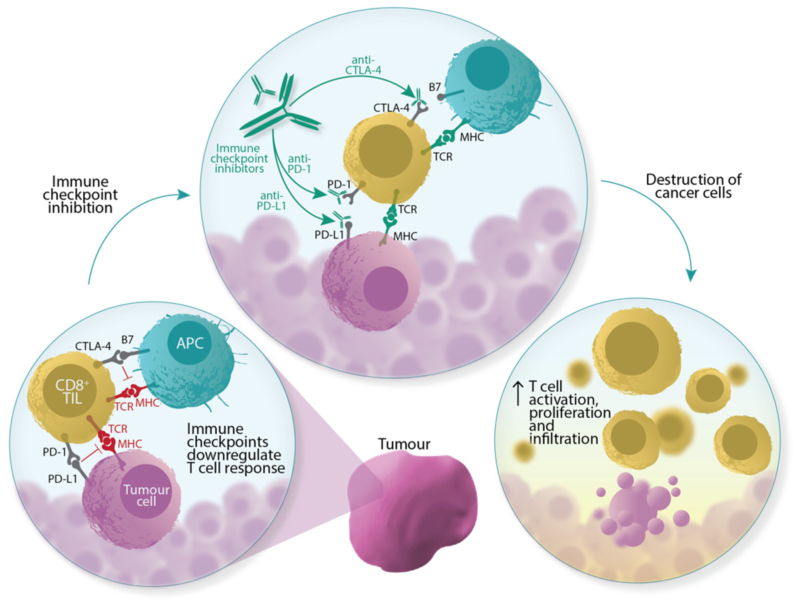

Authors: Syafiq Ramlee, David Hulse, Kinga Bernatowicz, Raquel Pérez-López, Evis Sala, & Luigi Aloj.

💡 Lay summary
------

- CD8+ tumour-infiltrating lymphocytes (CD8+ TILs) are a type of immune cell that help the body fight cancer, and they influence how well patients respond to treatments that use the immune system, like immunotherapy.

- In the clinic, assessing CD8+ TIL levels in a patient's tumour is done through tissue biopsies, which are invasive and pose practical challenges.

- Radiomics, the process of extracting detailed digital information from medical images, could offer a non-invasive way of evaluating CD8+ TIL levels.

- In this study, we reviewed the literature linking radiomic measurements and CD8+ TILs to summarise the current research and assess the quality of the methods used.

- We found that this kind of research is still quite new, so it’s not surprising that the studies had mixed results.

- There were also many differences between how the studies were done, which means that more work is needed to make radiomics research in this area more reliable.

⚙️ Role of CD8+ TILs
------

📝 Abstract
------

The tumour immune microenvironment influences the efficacy of immune checkpoint inhibitors. Within this microenvironment are CD8-expressing tumour-infiltrating lymphocytes (CD8+ TILs), which are an important mediator and marker of anti-tumour response. In practice, the assessment of CD8+ TILs via tissue sampling involves logistical challenges. Radiomics, the high-throughput extraction of features from medical images, may offer a novel and non-invasive alternative. We performed a systematic review of the available literature reporting radiomic signatures associated with CD8+ TILs. We also aimed to evaluate the methodological quality of the identified studies using the Radiomics Quality Score (RQS) tool, and the risk of bias and applicability with the Quality Assessment of Diagnostic Accuracy Studies (QUADAS-2) tool. Articles were searched from inception until 31 December 2021, in three electronic databases, and screened against eligibility criteria. Twenty-seven articles were included. A wide variety of cancers have been studied. The reported radiomic signatures were heterogeneous, with very limited reproducibility between studies of the same cancer group. The overall quality of studies was found to be less than desirable (mean RQS = 33.3%), indicating a need for technical maturation. Some potential avenues for further investigation are also discussed.

👇 Find our paper here!
------