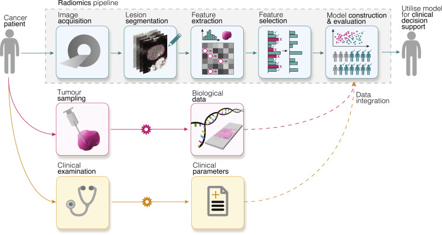

Authors: Cathal McCague, Syafiq Ramlee, Marika Reinius, Ian Selby, David Hulse, Pubudu Piyatissa, Vlad Bura, Mireia Crispin-Ortuzar, Evis Sala, & Ramona Woitek.

💡 Lay summary
------

- Radiomics is the field concerned with turning medical images into very detailed digital data -- data that can help clinicians better understand diseases and guide treatment decisions.

- In this paper, we wrote an introductory review explaining how radiomics works, highlighted key cancer studies, and explored its expanding use beyond cancer to improve clinical care.

⚙️ How radiomics works
------

📝 Abstract
------
Radiomics is a rapidly developing field of research focused on the extraction of quantitative features from medical images, thus converting these digital images into minable, high-dimensional data, which offer unique biological information that can enhance our understanding of disease processes and provide clinical decision support. To date, most radiomics research has been focused on oncological applications; however, it is increasingly being used in a raft of other diseases. This review gives an overview of radiomics for a clinical audience, including the radiomics pipeline and the common pitfalls associated with each stage. Key studies in oncology are presented with a focus on both those that use radiomics analysis alone and those that integrate its use with other multimodal data streams. Importantly, clinical applications outside oncology are also presented. Finally, we conclude by offering a vision for radiomics research in the future, including how it might impact our practice as radiologists.

👇 Find our paper here!
------